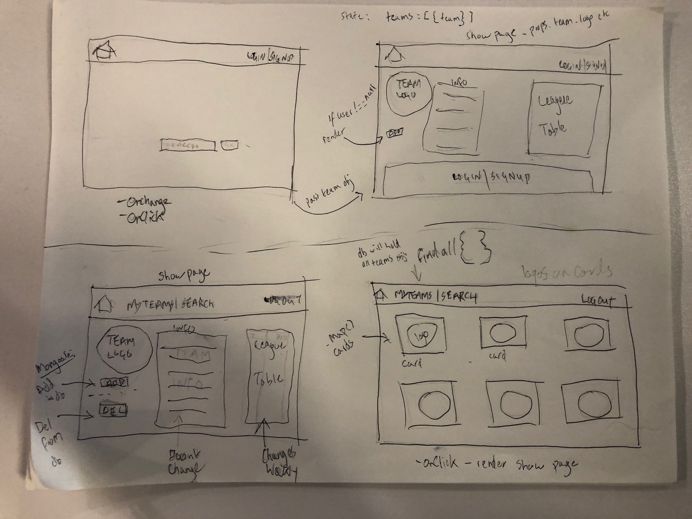
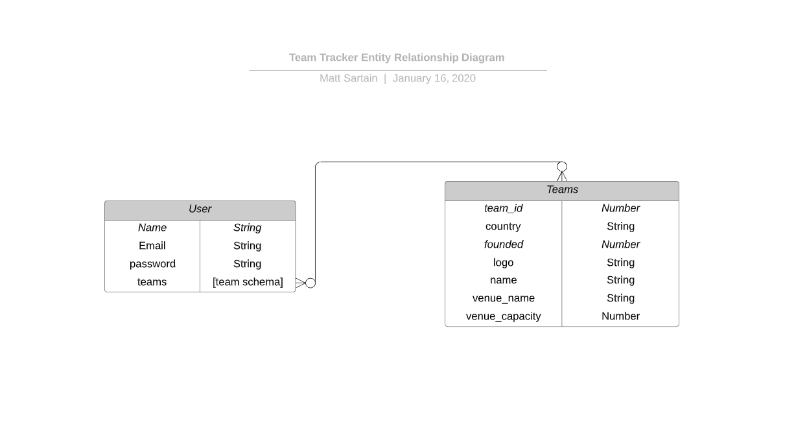

# Pitch Sitch

Welcome to Pitch Sitch, a English Premier League team tracking app. 

Search for your favorite teams, save them to your profile and view the current league table.

## Wireframes

## ERD:

## Technologies Used:

React.js
Mongoose
MongoDb Atlas
Express
Soccer Api
Node.js
JWT authentication
CSS

### Trello Link

https://trello.com/b/tlQF4bTn/team-tracker

### App screenshots

Landing view: 

Search team view:

Show view:

My Teaam view:

### Website Link:

https://pitch-sitch.herokuapp.com/

## Future enhancements

- refactor to have page render a lot cleaner but utilizing components more.
- Merge app functionality with Gerardo's soccer betting app
- Access to league table view whenever the user wants
- More stat data and trasnfer news for each team

